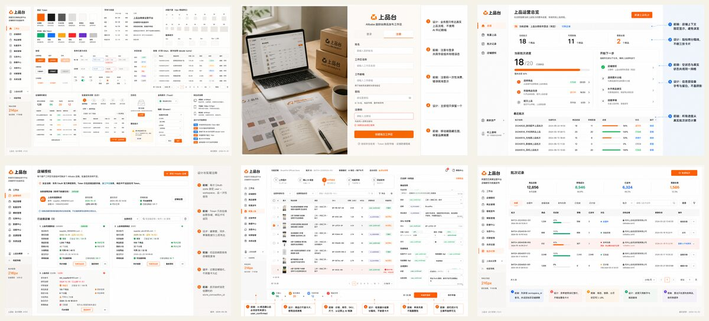
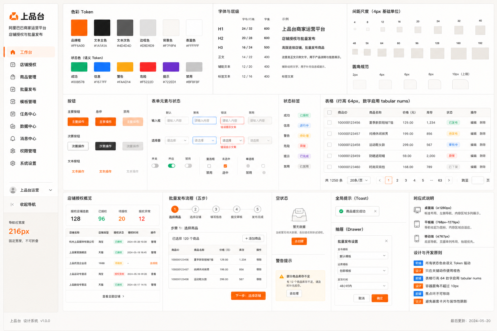
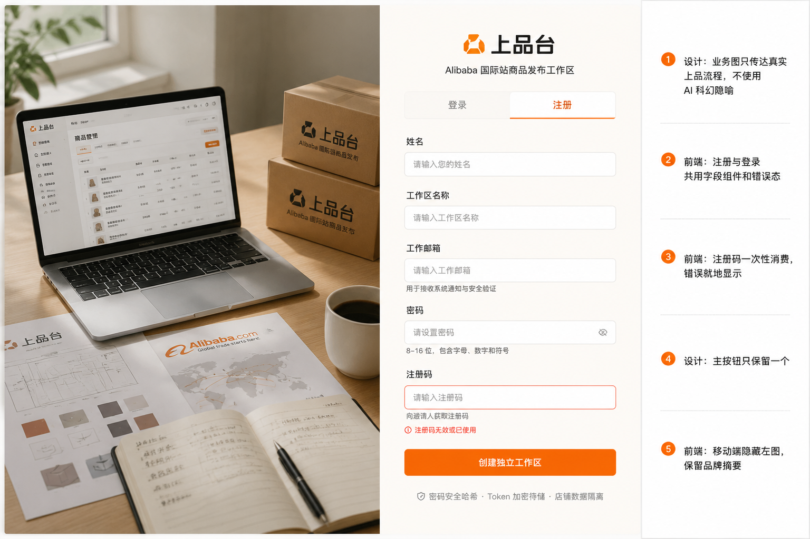
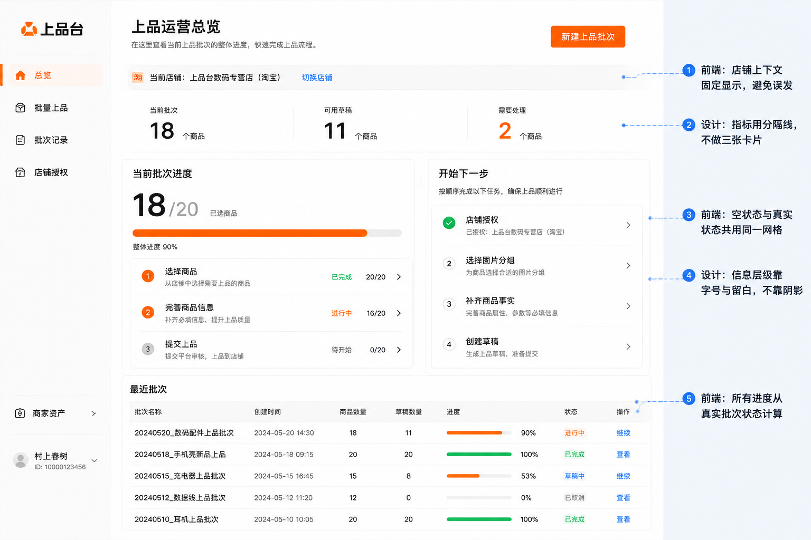
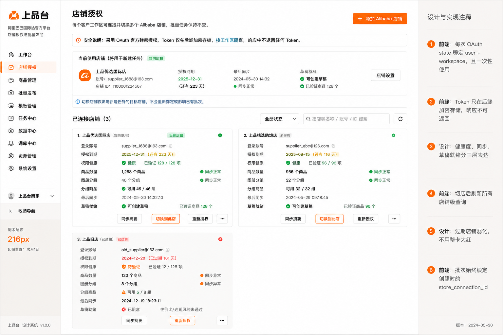
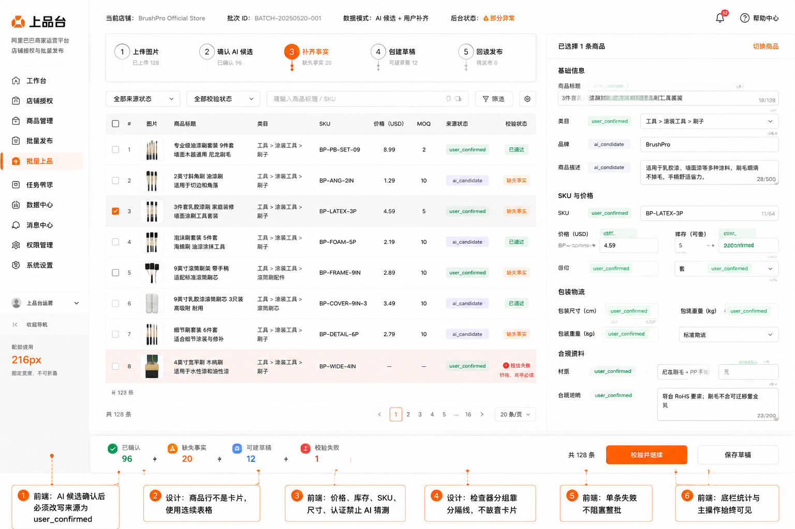
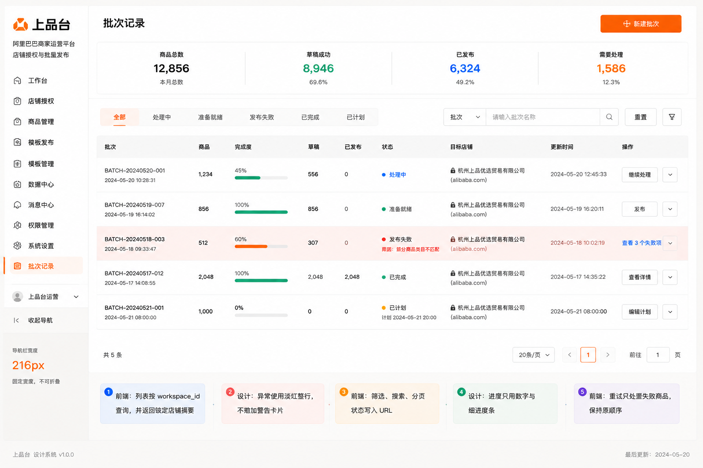

# 上品台 UI 设计稿

生成顺序：

1. `00-design-system.png`：唯一视觉范式与组件母版。
2. `01-auth.png`：登录与注册码注册。
3. `02-overview.png`：运营总览。
4. `03-stores.png`：店铺授权、多店切换与授权后摘要。
5. `04-workbench.png`：批量上品主工作台。
6. `05-batches.png`：批次记录。
7. `06-auth-business.png`：登录页左侧业务主视觉，并同步导出为 `frontend/public/auth-business.webp`。

除母版外，每张页面稿均以母版作为 GPT Image2 参考图生成，并在画面中保留前端工程师和 UI 设计师批注。

视觉方向：克制的 B2B 运营工具、暖色编辑式极简、单一 Alibaba 橙色强调、连续表格、清晰店铺上下文、少阴影、少圆角、无装饰性渐变。

## 预览

### 统一范式

### 页面

